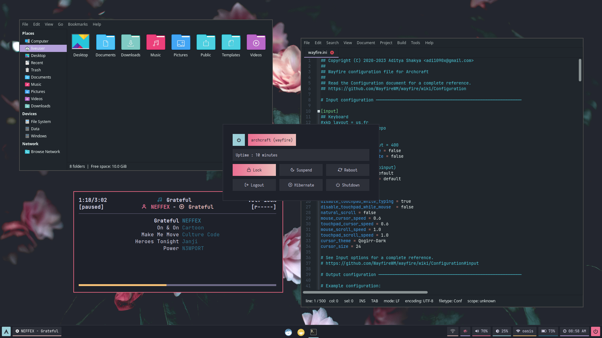
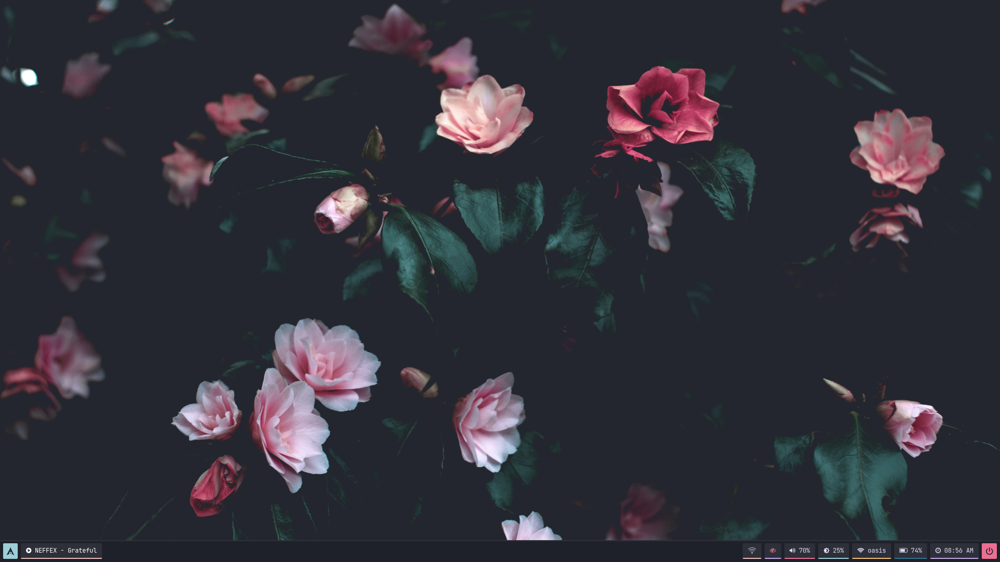
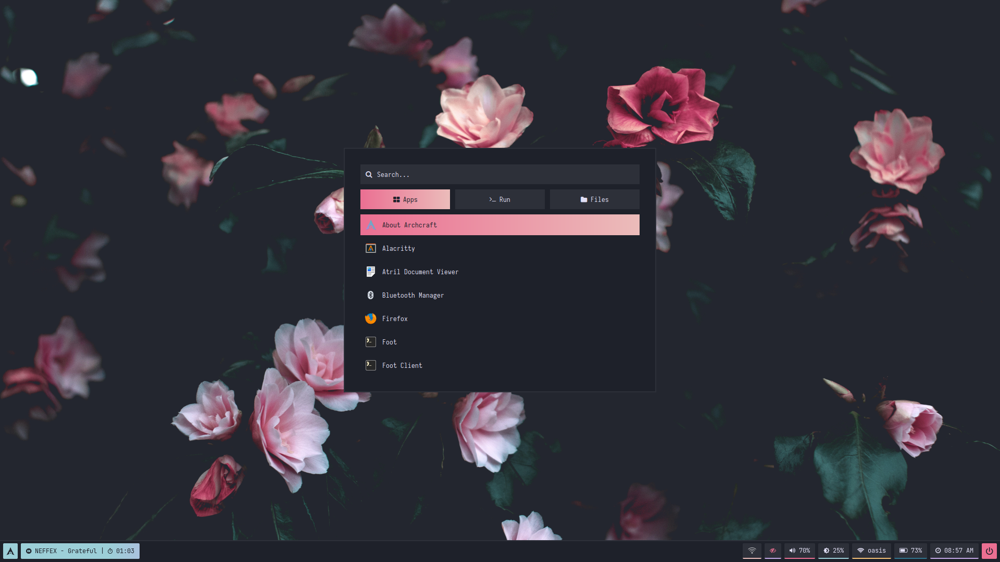
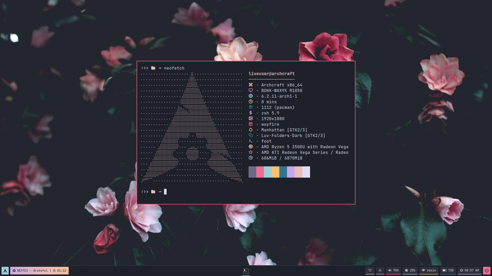

<h1 align="center">WAYFIRE</h1>

[](https://youtu.be/PXEerGOE8hc)

<p align="center">The ultimate Wayfire configuration (A Desktop Environment Like Experience)</p>

---

## Overview

Wayfire is a wayland compositor based on wlroots. It aims to create a customizable, extendable and lightweight environment without sacrificing its appearance.

- **Operating System** : `Archcraft`
- **Window Manager** : `Wayfire`
- **Status Bar** : `Waybar`
- **Launcher** : `Rofi` / `Wofi`
- **Session Manager** : `Rofi` / `Wlogout`
- **Notifications** : `Mako`
- **Terminal** : `Foot`
- **File Manager** : `Thunar`
- **Text Editor** : `Geany`
- **Web Browser** : `Firefox`

## Installation
- Get the files from : [Ko-fi :coffee:](https://ko-fi.com/s/f379e986f4) <sup>[**`Why Paid`**](https://github.com/adi1090x/adi1090x/blob/master/WHY.md)</sup>
- Extract The file **wayfire.tar.gz** with : `tar -xzvf wayfire.tar.gz`
- If you are using **`Archcraft`** (`Required: 2023 or later`) as your OS, You can just install the provided package with : `sudo pacman -U archcraft-wayfire-4.0-1-any.pkg.tar.zst`
- If you want to install this setup on _Arch Linux_ or on any _other distro_, follow the points below :
  - Install the following programs on your computer: `wayfire` `swaybg` `swayidle` `swaylock` `wlroots` `wl-clipboard` `waybar` `wofi`  `kanshi` `foot` `mako` `grim` `slurp` `wf-recorder` `light` `yad` `wlogout` `thunar` `geany` `mpv` `mpd` `mpc` `viewnior` `imagemagick` `xfce-polkit` `xorg-xwayland` `xdg-desktop-portal-wlr` `playerctl` `pastel` `python-pywal` `alacritty` `rofi` `pulsemixer`
  - After installing programs above, Copy Everything from _dotfiles_ to **`~/.config`** : `cp -r ./dotfiles/* ~/.config/` 
  - Logout and login to your amazingly configured Wayfire.

### Appearance

Install the following `theme`, `icon pack`, `cursors` and `fonts` for overall appearance.

- GTK Theme : [Manhattan gtk theme](https://github.com/archcraft-os/archcraft-themes/tree/main/archcraft-gtk-theme-manhattan)
- Icon Theme : [Luv-Folders-Dark icon theme](https://github.com/archcraft-os/archcraft-icons/tree/main/archcraft-icons-luv/files)
- Cursor Theme : [Qogir cursor theme](https://www.gnome-look.org/p/1366182/)
- Fonts : [JetBrainsMono Nerd Font](https://github.com/ryanoasis/nerd-fonts/releases/download/v2.1.0/JetBrainsMono.zip), [Iosevka Nerd Font](https://github.com/ryanoasis/nerd-fonts/releases/download/v2.1.0/Iosevka.zip), [Icomoon Feather](https://github.com/archcraft-os/archcraft-packages/blob/main/archcraft-fonts/files/icon-fonts/Icomoon-Feather.ttf), [Archcraft](https://github.com/archcraft-os/archcraft-packages/blob/main/archcraft-fonts/files/icon-fonts/archcraft.ttf)

## Config Structure
```
~/.config
├── wayfire.ini       : Master config file
└── wayfire           : Shared Files
    ├── alacritty     : Alacritty Terminal config
    ├── foot          : Foot Terminal config
    ├── mako          : Notification daemon config
    │   └── icons     : Notification icons
    ├── rofi          : Rofi config files
    ├── scripts       : Various scripts for functionality
    ├── theme         : Current Theme and Pywal Themes
    ├── wallpapers    : Wallpapers
    ├── waybar        : Statusbar config
    ├── wlogout       : Wlogout config
    │   └── icons     : Session icons
    └── wofi          : Launcher config
```

> By default, **[rofi](https://github.com/lbonn/rofi)** is used as app launcher.
>
> But, If you want to use **wofi** instead of **rofi**, Edit the config file `~/.config/wayfire.ini` and uncomment wofi keybindings (and, comment the rofi stuff as well).

> By default, **`MPD`** is used on waybar for music.
>
> But, If you want to use **Spotify** instead of **MPD**, Edit the config file `~/.config/wayfire/waybar/config` and uncomment the spotify module (and, comment the MPD module as well).

## Nvidia
If you're on `Archcraft` and install the provided package, There's nothing else you need to do in order to run it on Nvidia machine. The package's post_installation script does it all, And the compositor should work fine.

If you're running any other distribution and want to install this setup on your Nvidia machine, You need to do some tweaking. In this guide, I'm assuing you're using **Arch Linux**. Follow the steps below to make this wayland compositor work on Nvidia :

- Install **Nvidia Drivers** on your system. [NVIDIA](https://wiki.archlinux.org/title/NVIDIA) 
- Edit `/etc/mkinitcpio.conf` file and add **`nvidia`** kernel modules
```
MODULES="nvidia nvidia_modeset nvidia_uvm nvidia_drm"
```

- In the same file, Remove `kms` hook from hooks array if present.
- Rebuild your initrd file with : `sudo mkinitcpio -P linux`
- Edit `/etc/default/grub` file and add **`nvidia_drm.modeset=1`** kernel parameter for Nvidia
```
GRUB_CMDLINE_LINUX_DEFAULT="quiet splash nvidia_drm.modeset=1 ..."
```

- Update your grub config file with : `sudo grub-mkconfig -o /boot/grub/grub.cfg`
- Reboot your Nvidia Machine and login to your wayland compositor, It should work now.

More Information: [NVIDIA#Installation](https://wiki.archlinux.org/title/NVIDIA#Installation), [NVIDIA#DRM_kernel_mode_setting](https://wiki.archlinux.org/title/NVIDIA#DRM_kernel_mode_setting)

## Key bindings

### Keyboard
| Keys | Action |
| --- | --- |
| <kbd>super + Return</kbd> | Open terminal (alacritty)|
| <kbd>super + shift + Return</kbd> | Open fullscreen terminal (alacritty) |
| <kbd>super + Return</kbd> | Open terminal (foot)|
| <kbd>super + shift + Return</kbd> | Open terminal with custom geometry (foot) |
| <kbd>super + F</kbd> | Open file manager |
| <kbd>super + E</kbd> | Open text editor |
| <kbd>super + W</kbd> | Open web browser|
| <kbd>super + D</kbd> | App launcher (rofi)|
| <kbd>super + R</kbd> | Command Runner (rofi)|
| <kbd>super + N</kbd> | Network Menu (rofi)|
| <kbd>super + B</kbd> | Bluetooth Menu (rofi)|
| <kbd>super + X</kbd> | Power Menu (rofi)|
| <kbd>super + M</kbd> | Music Player (rofi)|
| <kbd>super + S</kbd> | Screenshot Applet (rofi)|
| <kbd>super + D</kbd> | Run app launcher (wofi)|
| <kbd>super + N</kbd> | Open network manager |
| <kbd>super + X</kbd> | Run session manager (wlogout)|
| <kbd>super + P</kbd> | Run colorpicker |
| <kbd>super + C/Q</kbd> | Kill active window |
| <kbd>ctrl + alt + L</kbd> | Run lockscreen |
| <kbd>super + ctrl + F</kbd> | Toggle fisheye effect |
| <kbd>super + Z</kbd> | Toggle idle |
| <kbd>super + Space</kbd> | Toggle fullscreen |
| <kbd>super + shift + T</kbd> | Toggle always_on_top |
| <kbd>super + shift + S</kbd> | Toggle sticky|
| <kbd>super + Left</kbd> | Tile window to the left edge |
| <kbd>super + Right</kbd> | Tile window to the right edge |
| <kbd>super + Up</kbd> | Maximize window |
| <kbd>super + Down</kbd> | Restore window's initial state |
| <kbd>super + H</kbd> | Tile window to the top-left edge |
| <kbd>super + J</kbd> | Tile window to the bottom-left edge |
| <kbd>super + K</kbd> | Tile window to the top-right edge |
| <kbd>super + L</kbd> | Tile window to the bottom-right edge |
| <kbd>super + Comma</kbd> | Tile window to the bottom edge |
| <kbd>super + Dot</kbd> | Tile window to the top edge |
| <kbd>alt + Tab</kbd> | Task switcher |
| <kbd>super + Tab</kbd> | Quick task switcher |
| <kbd>super + ctrl + Left</kbd> | Switch to left workspace |
| <kbd>super + ctrl + Right</kbd> | Switch to right workspace |
| <kbd>super + ctrl + Up</kbd> | Switch to top workspace |
| <kbd>super + ctrl + Down</kbd> | Switch to bottom workspace |
| <kbd>ctrl + alt + Left</kbd> | Left workspace (cube) |
| <kbd>ctrl + alt + Right</kbd> | Right workspace (cube) |
| <kbd>super</kbd> | Expo : Show overview of all workspace |
| <kbd>super + I</kbd> | Invert output colors |
| <kbd>super + V</kbd> | Show all windows on current workspace |
| <kbd>super + shift + V</kbd> | Show all windows from all workspaces |

### Mouse
| Button | Action |
| --- | --- |
| <kbd>super + left</kbd> | Move/Drag Window |
| <kbd>super + right</kbd> | Resize Window |
| <kbd>super + scroll</kbd> | Zoom the Desktop |
| <kbd>super + alt + scroll</kbd> | Adjust Opacity |
| <kbd>super + ctrl + right</kbd> | Rotate Window (2D) |
| <kbd>super + shift + right</kbd> | Rotate Window (3D) |
| <kbd>ctrl + alt + left</kbd> | Activate Cube |

## Screenshots

| Screenshot 1 | Screenshot 2 |
| --- | --- |
|||

| Screenshot 3 | Screenshot 4 |
| --- | --- |
|||

## Tour : Videos

**Here's the [Complete Youtube Playlist](https://youtube.com/playlist?list=PLXH9dADRlWHYk_5Boqiu7L3HcLVC83TWU)**

| Startup | Application Launcher |
| --- | --- |
|[](https://youtu.be/rb7esBfdYvA)|[](https://youtu.be/3KT9lZd6tuQ)|

| Opening and closing apps | Moving and Resizing |
| --- | --- |
|[](https://youtu.be/qdLq9SHcKuA)|[](https://youtu.be/Bt9uFceTRVw)|

| Zooming and Fisheye | Rotating Windows |
| --- | --- |
|[](https://youtu.be/D8prWw1av2Q)|[](https://youtu.be/Bv7Zx-BDC7M)|

| Window Management | Task Switcher |
| --- | --- |
|[](https://youtu.be/qRJ2IG_UqV8)|[](https://youtu.be/SbvYeLsk4o0)|

| Viewport switcher | Cube : Workspace |
| --- | --- |
|[](https://youtu.be/wUHCLc_o1r0)|[](https://youtu.be/z4jJZMc4rZc)|

| Expo : Workspace | Scale : Applications |
| --- | --- |
|[](https://youtu.be/P_3-DKxfzDY)|[](https://youtu.be/56nkD4zIj30)|

| Session Manager | Notifications |
| --- | --- |
|[](https://youtu.be/RxMXymcozXo)|[](https://youtu.be/7lVr7jjXXT4)|

| Invert |
| --- |
|[](https://youtu.be/LuBZHFAkWWo)|

---

### See Also

| [**`archcraft-river`**](https://github.com/archcraft-os/archcraft-river) | [**`archcraft-sway`**](https://github.com/archcraft-os/archcraft-sway) | [**`archcraft-hyprland`**](https://github.com/archcraft-os/archcraft-hyprland) | [**`archcraft-newm`**](https://github.com/archcraft-os/archcraft-newm) |
| --- | --- | --- | --- |
|[](https://github.com/archcraft-os/archcraft-river)|[](https://github.com/archcraft-os/archcraft-sway)|[](https://github.com/archcraft-os/archcraft-hyprland)| [](https://github.com/archcraft-os/archcraft-newm)|
