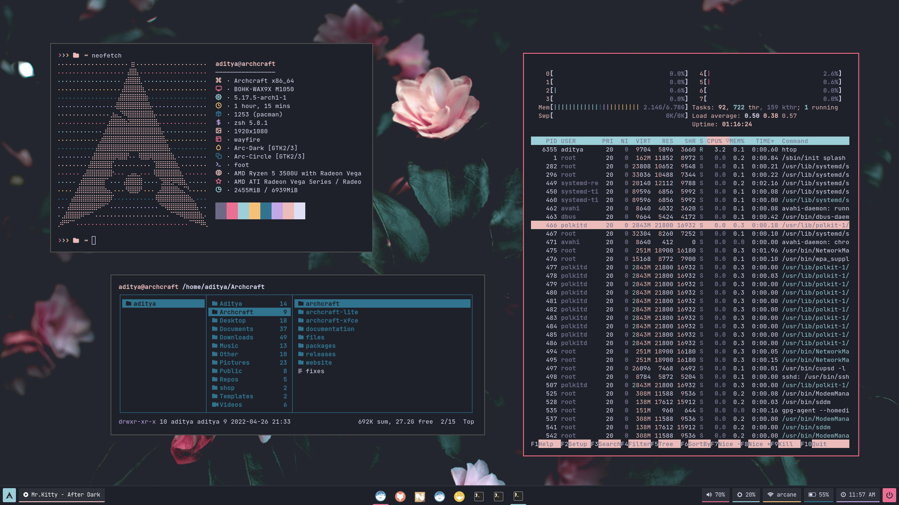

<h1 align="center">WAYFIRE</h1>

[](https://youtu.be/PXEerGOE8hc)

<p align="center">The ultimate Wayfire configuration (A Desktop Environment Like Experience)</p>

---

## Overview

Wayfire is a wayland compositor based on wlroots. It aims to create a customizable, extendable and lightweight environment without sacrificing its appearance.

- **Operating System** : `Archcraft`
- **Window Manager** : `Wayfire`
- **Status Bar** : `Waybar`
- **Launcher** : `Wofi`
- **Session Manager** : `Wlogout`
- **Notifications** : `Mako`
- **Terminal** : `Foot`
- **File Manager** : `Thunar`
- **Text Editor** : `Geany`
- **Web Browser** : `Firefox`

## Installation
- Get the files from : [Ko-fi :coffee:](https://ko-fi.com/s/f379e986f4)
- Extract The file **wayfire.tar.gz** with : `tar -xzvf wayfire.tar.gz`
- If you are using **`Archcraft`** as your OS, You can just install the provided package with : `sudo pacman -U archcraft-wayfire-1.0-1-any.pkg.tar.zst`
- If you want to install this setup on _Arch Linux_ or on any _other distro_, follow the points below :
  - Install the following programs on your computer: `wayfire` `swaybg` `swayidle` `swaylock` `wlroots` `wl-clipboard` `waybar` `wofi`  `kanshi` `foot` `mako` `grim` `slurp` `wf-recorder` `light` `yad` `wlogout` `thunar` `geany` `mpd` `mpc` `viewnior` `imagemagick` `xfce-polkit`
  - After installing programs above, Copy Everything from _dotfiles_ to **`~/.config`** : `cp -r ./dotfiles/* ~/.config/` 
  - Logout and login to your amazingly configured Wayfire.

> GTK themes, icons and cursor-theme are provided in **`gtk`** directory.

## Config Structure
```
~/.config
├── wayfire.ini       : Master config file
└── wayfire           : Shared Files
    ├── foot          : Terminal config
    ├── mako          : Notification daemon config
    │   └── icons     : Notification icons
    ├── scripts       : Various scripts for functionality
    ├── wallpapers    : Wallpapers
    ├── waybar        : Statusbar config
    ├── wlogout       : Wlogout config
    │   └── icons     : Session icons
    └── wofi          : Launcher config
```

## Key bindings

### Keyboard
| Keys | Action |
| --- | --- |
| <kbd>super + Return</kbd> | Open terminal |
| <kbd>super + shift + Return</kbd> | Open terminal with custom geometry |
| <kbd>super + F</kbd> | Open file manager |
| <kbd>super + E</kbd> | Open text editor |
| <kbd>super + W</kbd> | Open web browser|
| <kbd>super + D</kbd> | Run app launcher |
| <kbd>super + N</kbd> | Open network manager |
| <kbd>super + X</kbd> | Run session manager |
| <kbd>super + P</kbd> | Run colorpicker |
| <kbd>ctrl + alt + L</kbd> | Run lockscreen |
| <kbd>super + ctrl + F</kbd> | Toggle fisheye effect |
| <kbd>super + Z</kbd> | Toggle idle |
| <kbd>super + Space</kbd> | Toggle fullscreen |
| <kbd>super + shift + T</kbd> | Toggle always_on_top |
| <kbd>super + shift + S</kbd> | Toggle sticky|
| <kbd>super + Left</kbd> | Tile window to the left edge |
| <kbd>super + Right</kbd> | Tile window to the right edge |
| <kbd>super + Up</kbd> | Maximize window |
| <kbd>super + Down</kbd> | Restore window's initial state |
| <kbd>super + H</kbd> | Tile window to the top-left edge |
| <kbd>super + J</kbd> | Tile window to the bottom-left edge |
| <kbd>super + K</kbd> | Tile window to the top-right edge |
| <kbd>super + L</kbd> | Tile window to the bottom-right edge |
| <kbd>super + Comma</kbd> | Tile window to the bottom edge |
| <kbd>super + Dot</kbd> | Tile window to the top edge |
| <kbd>alt + Tab</kbd> | Task switcher |
| <kbd>super + Tab</kbd> | Quick task switcher |
| <kbd>super + ctrl + Left</kbd> | Switch to left workspace |
| <kbd>super + ctrl + Right</kbd> | Switch to right workspace |
| <kbd>super + ctrl + Up</kbd> | Switch to top workspace |
| <kbd>super + ctrl + Down</kbd> | Switch to bottom workspace |
| <kbd>ctrl + alt + Left</kbd> | Left workspace (cube) |
| <kbd>ctrl + alt + Right</kbd> | Right workspace (cube) |
| <kbd>super</kbd> | Expo : Show overview of all workspace |
| <kbd>super + I</kbd> | Invert output colors |
| <kbd>super + V</kbd> | Show all windows on current workspace |
| <kbd>super + shift + V</kbd> | Show all windows from all workspaces |

### Mouse
| Button | Action |
| --- | --- |
| <kbd>super + left</kbd> | Move/Drag Window |
| <kbd>super + right</kbd> | Resize Window |
| <kbd>super + scroll</kbd> | Zoom the Desktop |
| <kbd>super + alt + scroll</kbd> | Adjust Opacity |
| <kbd>super + ctrl + right</kbd> | Rotate Window (2D) |
| <kbd>super + shift + right</kbd> | Rotate Window (3D) |
| <kbd>ctrl + alt + left</kbd> | Activate Cube |

## Tour : Videos

**Here's the [Complete Youtube Playlist](https://youtube.com/playlist?list=PLXH9dADRlWHYk_5Boqiu7L3HcLVC83TWU)**

| Startup | Application Launcher |
| --- | --- |
|[](https://youtu.be/rb7esBfdYvA)|[](https://youtu.be/3KT9lZd6tuQ)|

| Opening and closing apps | Moving and Resizing |
| --- | --- |
|[](https://youtu.be/qdLq9SHcKuA)|[](https://youtu.be/Bt9uFceTRVw)|

| Zooming and Fisheye | Rotating Windows |
| --- | --- |
|[](https://youtu.be/D8prWw1av2Q)|[](https://youtu.be/Bv7Zx-BDC7M)|

| Window Management | Task Switcher |
| --- | --- |
|[](https://youtu.be/qRJ2IG_UqV8)|[](https://youtu.be/SbvYeLsk4o0)|

| Viewport switcher | Cube : Workspace |
| --- | --- |
|[](https://youtu.be/wUHCLc_o1r0)|[](https://youtu.be/z4jJZMc4rZc)|

| Expo : Workspace | Scale : Applications |
| --- | --- |
|[](https://youtu.be/P_3-DKxfzDY)|[](https://youtu.be/56nkD4zIj30)|

| Session Manager | Notifications |
| --- | --- |
|[](https://youtu.be/RxMXymcozXo)|[](https://youtu.be/7lVr7jjXXT4)|

| Invert |
| --- |
|[](https://youtu.be/LuBZHFAkWWo)|

## FYI
- May or may not work on [**`Nvidia`**](https://wiki.archlinux.org/title/wayland#Requirements).
- Thank you for your support.
